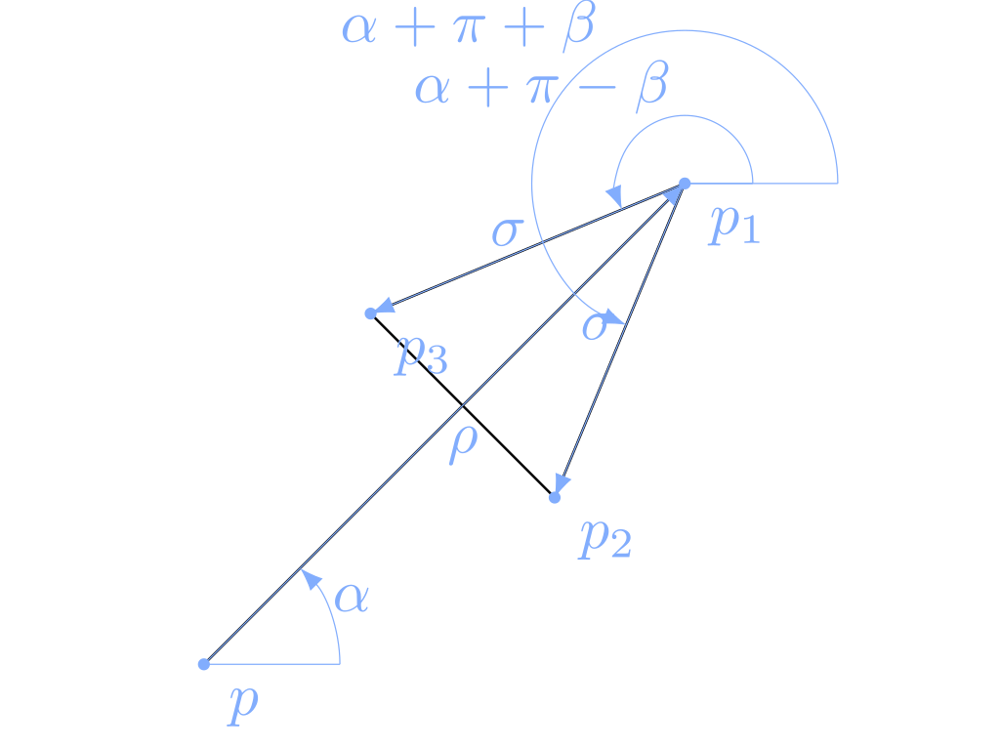

# KhepriIllustrator

[](https://aptmcl.github.io/KhepriIllustrator.jl/stable/)
[](https://aptmcl.github.io/KhepriIllustrator.jl/dev/)
[](https://github.com/aptmcl/KhepriIllustrator.jl/actions/workflows/CI.yml?query=branch%3Amaster)
[](https://codecov.io/gh/aptmcl/KhepriIllustrator.jl)

KhepriIllustrator generates a schematic explanation of a Khepri program.

## Installation

Install with the Julia package manager [Pkg](https://pkgdocs.julialang.org/):

```jl
pkg> add KhepriIllustrator  # Press ']' to enter the Pkg REPL mode.
```
or
```jl
julia> using Pkg; Pkg.add("KhepriIllustrator")
```

## Usage

```jl
using KhepriIllustrator
using KhepriTikZ # A backend is needed to visualize the output

@illustrator arrow(p, ρ, α, σ, β) =
  let p_1 = p + vpol(ρ,α),
      p_2 = p_1 + vpol(σ, α + π + β)
      p_3 = p_1 + vpol(σ, α + π - β)
    line(p, p_1, p_2, p_3,p_1)
  end

delete_all_shapes()
@illustrator arrow(xy(0,0), 4, π/4, 2, π/8)
render_view()
```

The result, using the KhepriTikZ backend, shows in the Plots pane, as follows:


